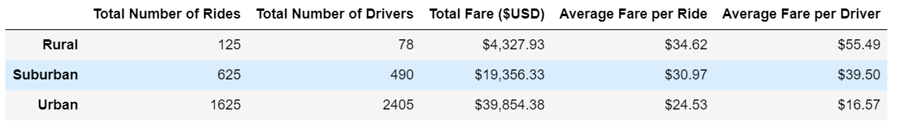

# PyBer_Analysis
using the Matplotlib library for data visualization and SciPy package for summary statistics

## Overview
We are embarking on this analysis in order to better understand PyBer's demographics and see how we can better serve our customers. Specifically, we want to know more about differences in customer experience based on location. To do his, we have grouped the customer data into 3 types: urban, suburban, and rural. 

### Resources
Data Source: city_data.csv, ride_data.csv
Software: Python 3.6.1
Tools: Jupyter Notebook 6.1.4

## Results
Breaking it up by city type, we can see the following

### Total Rides 
There are 5 times the rides in suburban areas as there are in rural areas. There are 13 times the rides in ruban areas as there are in rural areas. This means PyBer has a much stronger presence in urban areas. 
### Total Drivers 
There are roughly 6 times the drivers in suburban areas as there are in rural areas. There are roughly 30 times more drivers in urban areas as there are in rural areas. 

### Total Fares 
Across city types, PyBer's total US fares for 2019 was $63,538.64. The total fares correspond with the number of rides called, which makes sense. 

### Average Fare per Ride  
PyBer customers in rural areas are paying the most on average per ride ($34.62), followed by customers in suburban areas ($30.97). Customers in urban areas pay the lowest on average ($24.53). There are probably a number of factors that go into fare price, like miles traveled. It makes sense that rides in rural areas cost more on average because each ride is probably longer than one within an urban area; but this is worth exploring more. 

### Average Fare per Driver
Despite being responsible for 62% of Pyber's fares, drivers in urban areas make the lowest per ride on average. In both rural and suburban areas, drivers make more than how much each rider pays, on average. This is not the case for urban drivers.

### Weekly Fare by City Type

While there are some general trends, these lines never overlap. Throughout the first few months, rural customers generates the most money in fares, followed by suburban customers and then rural customers. There seems to be a peak across city types around the end of February. We should look at this data across mutliple years to see if we can observe any cyclical/monthly trends. 

## Summary
Given these results, I recommend PyBer take the following actions:
  - 1. It could be worth altering the percent of the fare the drivers get to keep based on where they are located. It may be important going forward for PyBer's branding going forward to not appear as yet another "Big Tech" company that is solely focused on profits and not the well-being of its workers in the gig economy.
  - 2.  Looking at the Weekly Fare by City Type, it could be worth consering a special discount with frequent rides in early January, as that month seems to not generate much money across the board.
  - 3. We may want to expand our marketing in rural areas, as we currently do not have many customers there.
